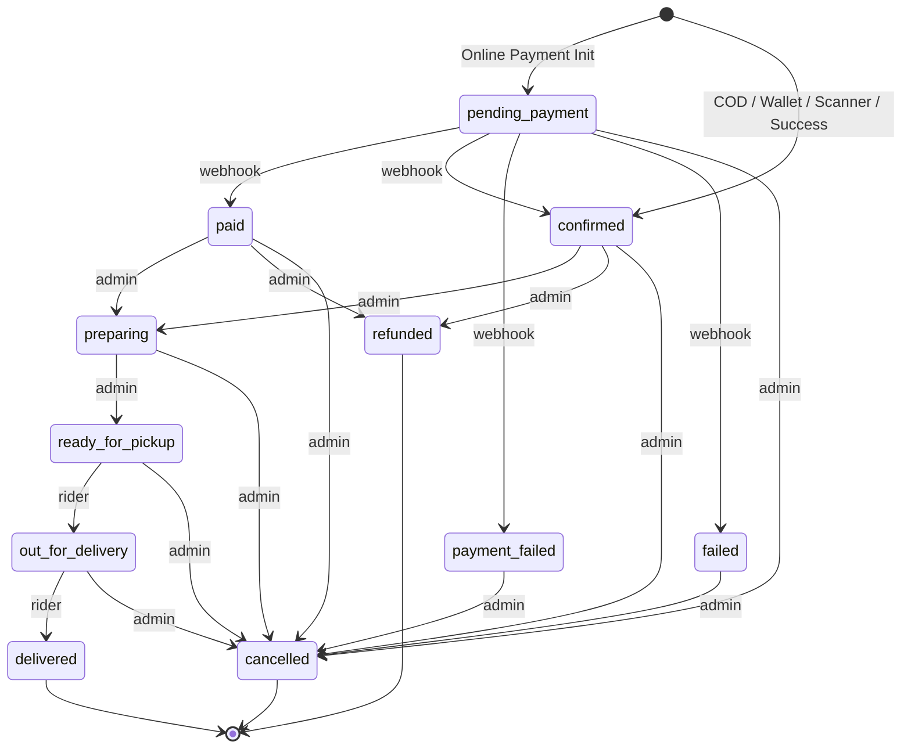

# Order Lifecycle State Machine — Regression & Transition Matrix

This matrix maps out the allowed states, actors, and transitions of the order lifecycle state machine. It serves as a testing guide to verify that updates to the codebase do not violate the FSM invariants.

---

## 1. Initial State Resolution Matrix

When an order is created, the system calls `resolveOrderStatusAndPaymentStatus(paymentMode)` to determine the initial `status`, `paymentStatus`, and `paymentMethod`.

| Payment Mode | Resolved Initial `status` | Resolved Initial `paymentStatus` | Resolved Initial `paymentMethod` | Description |
| :--- | :--- | :--- | :--- | :--- |
| **COD** / **CASH** | `confirmed` | `PENDING` | `COD` | Cash on delivery. Active order is confirmed immediately. |
| **WALLET** | `confirmed` | `PAID` | `WALLET` | Local wallet checkout. Paid instantly without redirects. |
| **SCANNER** / **PAYNOW** | `confirmed` | `PAID` | `SCANNER` | Prepaid SGQR / QR code scanner. Paid before order creation. |
| **ONLINE** / **STRIPE** (Initial) | `pending_payment` | `PENDING` | `ONLINE` | Standard credit card. Customer redirected to Stripe Checkout. |
| **ONLINE** (Success Webhook) | `confirmed` | `PAID` | `STRIPE` | Stripe webhook indicates successful payment completion. |
| **ONLINE** (Failure Webhook) | `payment_failed` | `FAILED` | `STRIPE` | Stripe webhook indicates charge failed. |

---

## 2. Order State Transitions & Actors

Only specific actors are permitted to perform transitions. The table below lists all valid transitions from any given current state.

### Transition Reference Table

| From State | To State | Permitted Actor | Trigger Event / Description |
| :--- | :--- | :--- | :--- |
| `pending_payment` | `paid` | `webhook` | Online payment completed successfully (Stripe webhook) |
| `pending_payment` | `confirmed` | `webhook` | Online payment succeeded and auto-confirmed |
| `pending_payment` | `payment_failed` | `webhook` | Online payment failed or was declined |
| `pending_payment` | `failed` | `webhook` | Payment transaction failed at gateway |
| `pending_payment` | `cancelled` | `admin` | Administrator cancelled the unpaid order |
| `placed` | `preparing` | `admin` | Merchant accepts and starts preparing the COD order |
| `placed` | `cancelled` | `admin` | Administrator cancels the COD order |
| `placed` | `refunded` | `admin` | Merchant issues refund |
| `paid` | `preparing` | `admin` | Merchant accepts and starts preparing the paid order |
| `paid` | `cancelled` | `admin` | Merchant cancels and releases the paid order |
| `paid` | `refunded` | `admin` | Merchant issues refund |
| `confirmed` | `preparing` | `admin` | Merchant starts preparing the order |
| `confirmed` | `cancelled` | `admin` | Merchant cancels the order |
| `confirmed` | `refunded` | `admin` | Merchant issues refund |
| `preparing` | `ready_for_pickup` | `admin` | Merchant completes preparation of the items |
| `preparing` | `cancelled` | `admin` | Merchant cancels the order in preparation |
| `ready_for_pickup` | `out_for_delivery` | `rider` | Rider accepts and picks up order for delivery |
| `ready_for_pickup` | `cancelled` | `admin` | Administrator cancels the ready order |
| `out_for_delivery` | `delivered` | `rider` | Rider delivers order to the customer |
| `out_for_delivery` | `cancelled` | `admin` | Administrator cancels order in transit |
| `failed` | `cancelled` | `admin` | Unsuccessful transaction marked as cancelled |
| `payment_failed` | `cancelled` | `admin` | Failed payment marked as cancelled |

*Note: Terminal states (`delivered`, `cancelled`, `refunded`) permit no outbound transitions.*

---

## 3. Strict Consistency Guards (Invariants)

To prevent data corruption, `assertPaymentConsistency` enforces the following invariants:

1. **COD Orders**:
   - Must have `paymentMethod` of `COD` or `CASH`.
   - Cannot have `paymentStatus: PAID` unless the order is in a terminal state (`delivered`, `refunded`, or `cancelled`).
   - Active state `paymentStatus` must remain `PENDING`, `UNPAID`, or `NOT_APPLICABLE`.

2. **Scanner (PayNow QR) / Wallet Orders**:
   - Must have `paymentMethod` of `SCANNER`, `PAYNOW`, or `WALLET`.
   - Active state (`status: confirmed`) **requires** `paymentStatus: PAID`.
   - Active state **cannot** be `pending_payment` or `payment_failed`.

3. **Stripe / Online Orders**:
   - Must have `paymentMethod` of `STRIPE` or `ONLINE`.
   - Active lifecycle status (`placed`, `preparing`, `ready_for_pickup`, `out_for_delivery`) **requires** `paymentStatus: PAID`.
   - `status: pending_payment` **requires** `paymentStatus: PENDING` or `UNPAID`.
   - `status: payment_failed` **requires** `paymentStatus: FAILED`.
